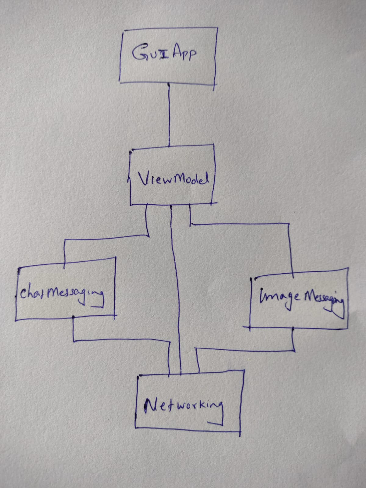
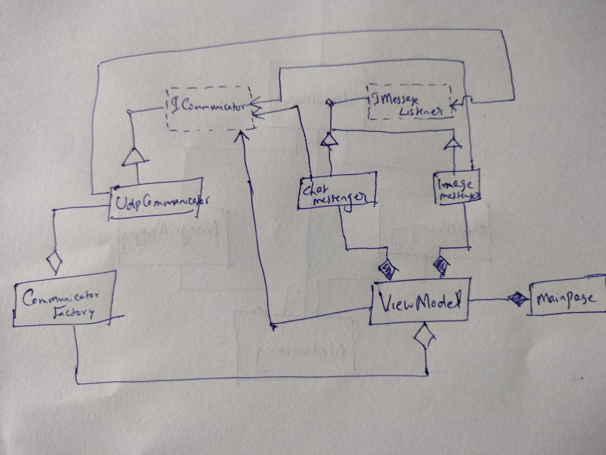

# Overview
This is a sample project that demonstrates how to design and develop a distributed computing software that also involves GUI. It is based on sound object oriented programming principles, and employs various design patterns.

# Design
These are the modules in this project

- **Networking**

This module defines the types required to send and receive data across process/machine boundaries.
 - *Udp Communicator*: A class that communicates via the UDP protocol.
   - This is a *serialized messaging passing* model as opposed to an *inter-object communication* model like RPC or .NET Remoting. This implies that the module needs to serialize the data before sending it as bytes. On the receiving end, the data is deserialized, and the original message recreated. While the serialization and conversion to-and-from bytes are handled by the networking layer, it has the benefit that the networking module is agnostic to the type of the message. It just sends and receives messages. The messages themselves are processed by higher level modules that care about the format and the details of the message.
   - UDP is a less reliable protocol than TCP. But we are going with UDP here to keep this simple for a demo program.
 - *Communicator Factory*: This class uses the *factory pattern* to abstract away the details of the communicator implementation from its clients.
 - *Message Listener Interface*: This interface lets clients subscribe for notifications from the communicator. If the communicator receives a message meant for a particular client, the client can register for callback notification from the communicator via this interface. We use the *Publisher-Subscriber* design pattern here.

- **ChatMessaging**
This is a simple demonstration of a *processing module*, one that processes data. In this case, this module handles chat messages passed to it from the UX layer, and sends them over to the communication layer. It also subscribes for notifications from the communication layer. You could imagine a lot more involved design for a more substantial project; with metadata, storage, and analysis capabilities. In this case, we are keeping the module simple given it is a demo project.

- **ImageMessaging**
This module is similar to the ChatMessaging module, except that it processes image messages instead of chat messages.

- **ViewModel**
We are using the Model-View-ViewModel (MVVM) design pattern for our User Experience layer, and this module serves as the ViewModel component of this architecture.

- **GuiApp**
This module is the *View* of our User Experience layer, and defines its XAML based GUI.

- **Tests**
This module defines unit tests, integration tests and end-to-end tests for this project.

# Environment
The project builds and runs with Visual Studio Community 2022 when the required workloads are installed.
